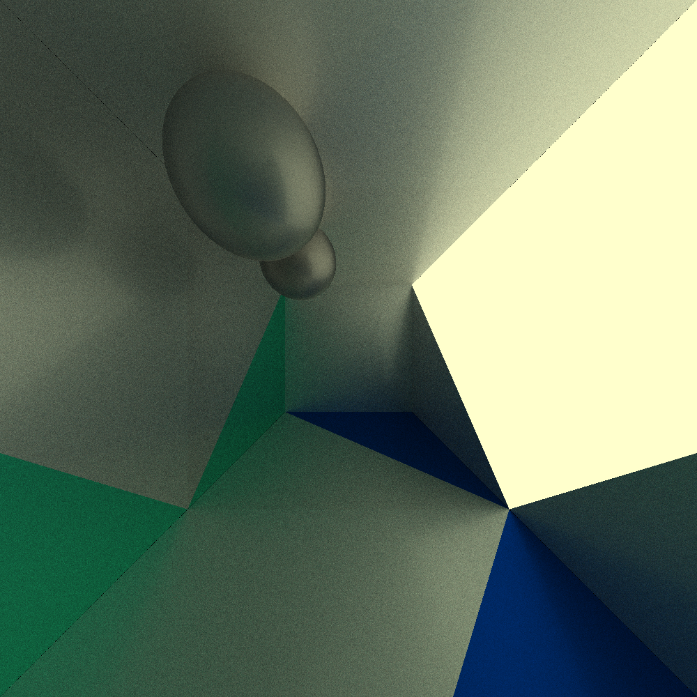
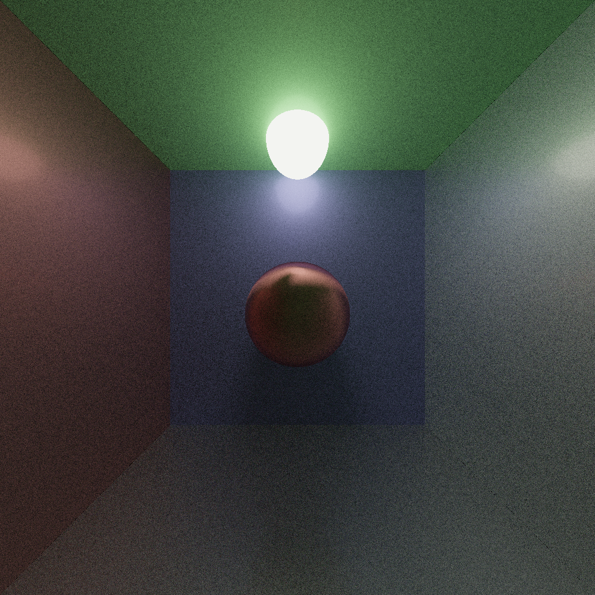

# SOLID-Tracer
This is a total remaster of an old Raytracer I made, only know I follow standard conventions and aim for actually pleasant code

## How To Use 
Nagivate to `src/SceneConfig.cc` and set the configuration you want.

Run `run-scripts/release.md`

## Example Scenes
## 200 Rays, 5 Bounces

## 100 Rays, 5 Bounces

# 300 Rays, 10 Bounces 

