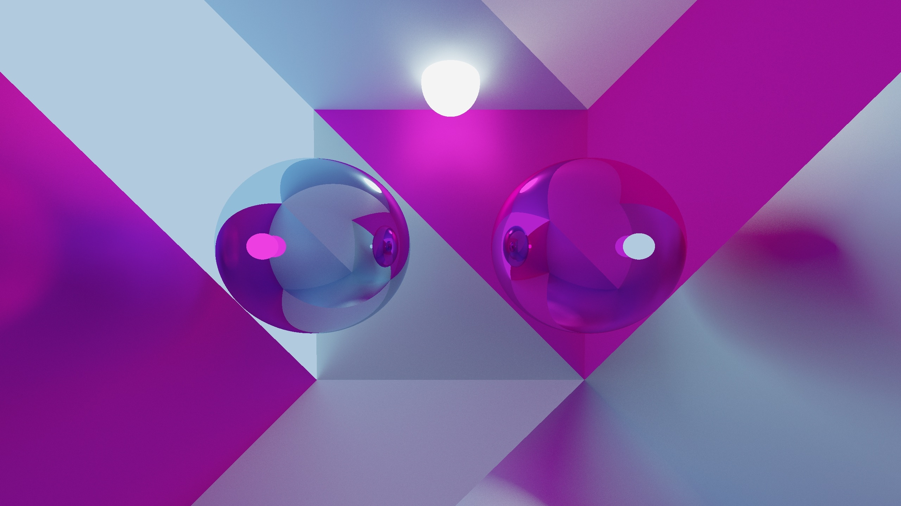

# Raytracer
This is a total remaster of an old Raytracer I made, only now I aim for pleasant code

All maths used was derived by me - that is not to say it is brand new!

This was done to learn better programming practises in C++, as such I chose to use no external libraries. Why not reinvent the wheel! 

#### *Update: A preview mode was added - this was done in SDL2*

#### *Note: SDL2 is an optional dependency - if you do not have it installed the Previewer will be disabled but nothing else*

## How To Use 

Clone the Repository

Choose either the Software or Hardware version

Run `compile-scripts/release.sh` in the root of the project directory to compile the program

Modify the Colour, Object and Scene `.ini` and set the configuration you want.

Run ./run.sh 

### Software Version

Run the `get_dependencies.sh` script (for Debian/Ubuntu platforms) to automatically install all needed packages

Alternatively, mandatory requirements are:
- Meson
- Ninja
  
(both can be pip installed)
- C++23 compilter

And for the full extent of features available:
- SDL2

Continue

### Hardware Version
*(Note: I prefer running commands through apptainer but forming the container from Docker)*

Run `docker build -t better-raytracer .`

Run `apptainer build better_raytracer.sif docker-daemon://better_raytracer:latest`

Run `apptainer shell better_raytracer.sif` to then enter a session

Continue

### Modifying the input values 
* [Input Values](./instructions/ini_values.md)

### How to use the preview tool
* [Preview Tool](./instructions/preview_tool.md)

Run `./build/raytracer`

## Example Scenes

## 500 Rays, 10 Bounces 

## 1000 Rays, 20 Bounces 

## 1200 Rays, 20 Bounces

