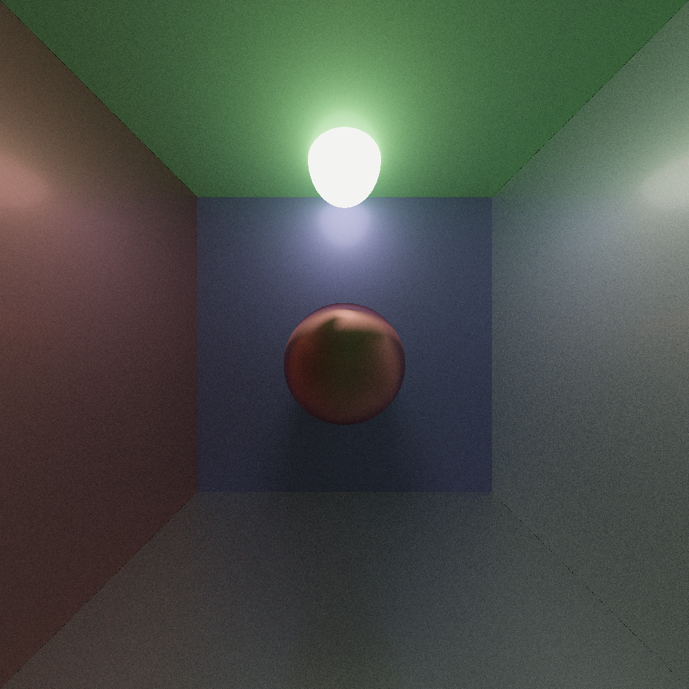
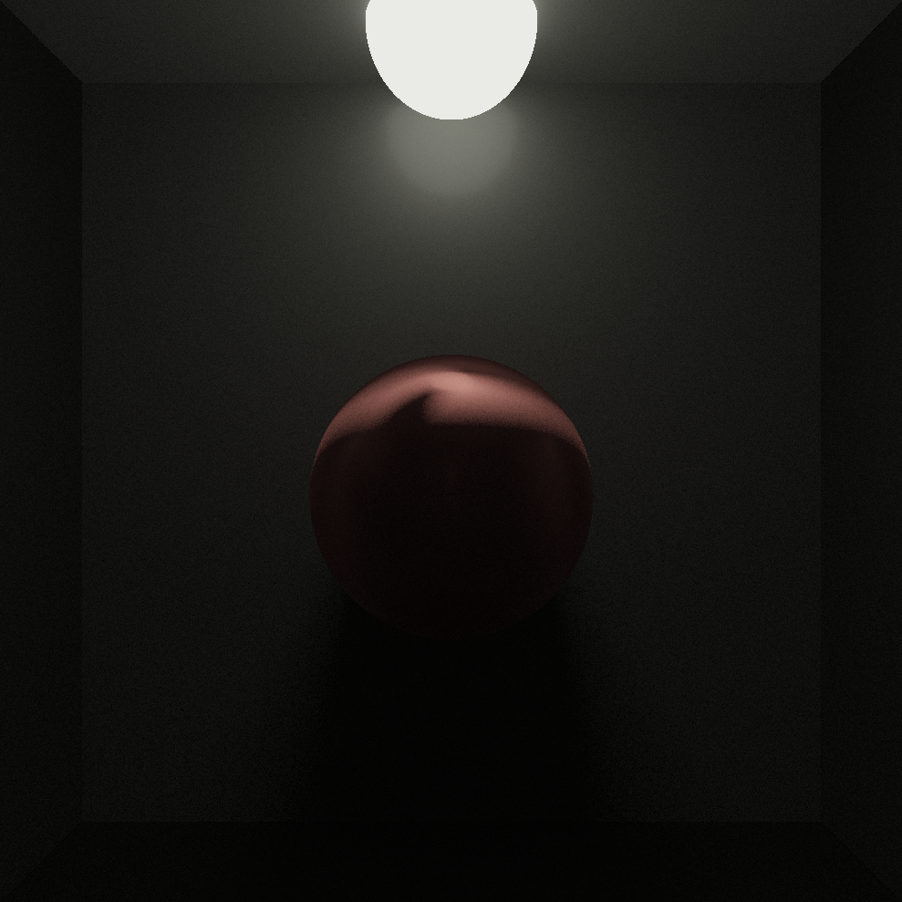
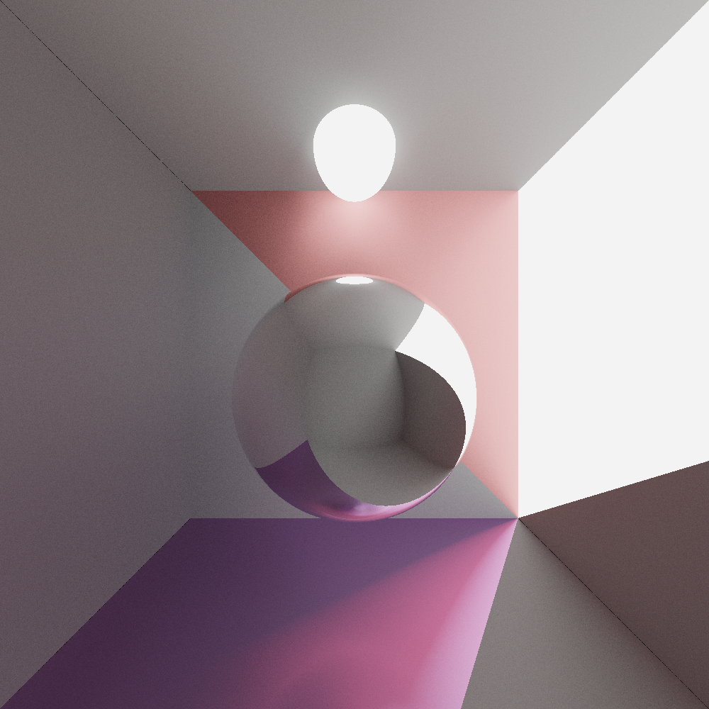
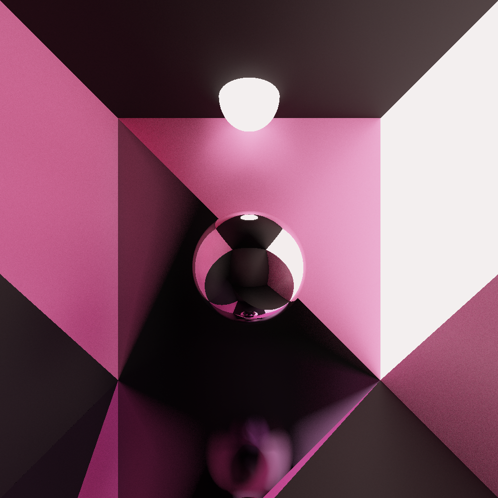
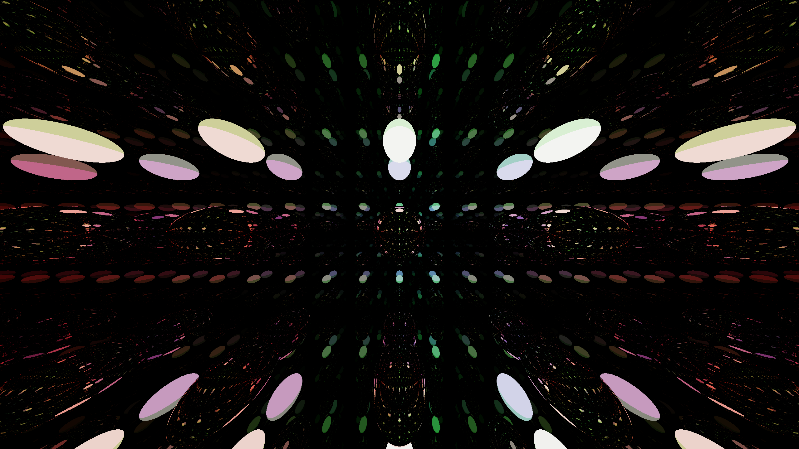

# SOLID-Tracer
This is a total remaster of an old Raytracer I made, only now I aim for pleasant code

## How To Use 
Clone the Repository

Run the `get_dependencies.sh` script (for Debian/Ubuntu platforms) to automatically install all needed packages

Run `compile-scripts/release.sh` to compile the program

Modify the Colour, Object and Scene `.ini` and set the configuration you want.

Run `./build/raytracer`

## Example Scenes

## 500 Rays, 10 Bounces 

## 1000 Rays, 20 Bounces 

## 1200 Rays, 20 Bounces

