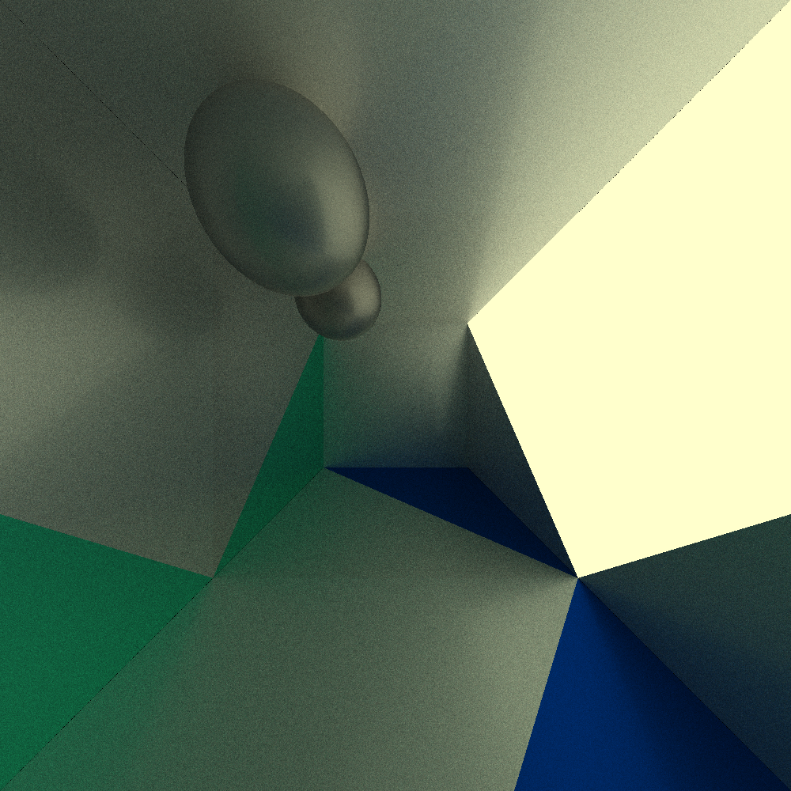
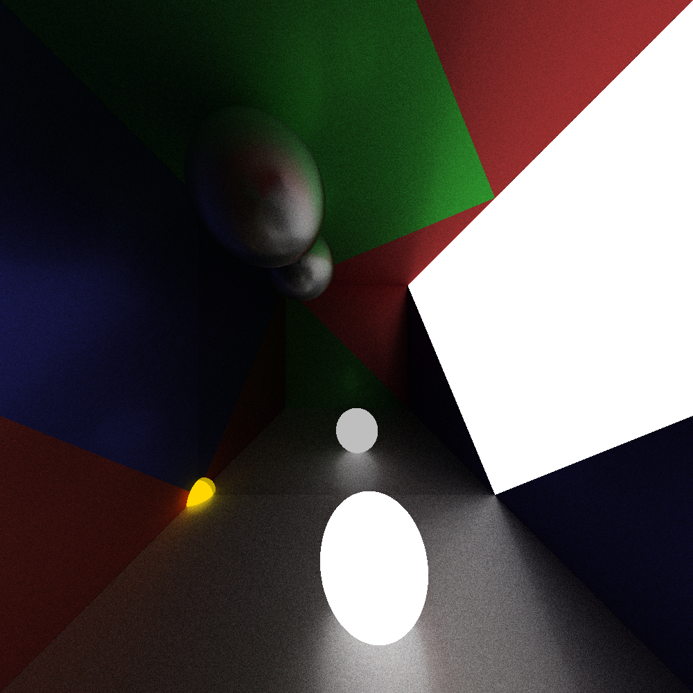

# SOLID-Tracer
This is a total remaster of an old Raytracer I made, only now I aim for pleasant code

## How To Use 
Clone the Repository

Run the `get_dependencies.sh` script (for Debian/Ubuntu platforms) to automatically install all needed packages

Nagivate to `src/SceneConfig.cc` and set the configuration you want.

Run `run-scripts/release.sh`

## Example Scenes
## 200 Rays, 5 Bounces

## 300 Rays, 5 Bounces

## 500 Rays, 10 Bounces 

## 1000 Rays, 20 Bounces 

## 1000 Rays, 20 Bounces 

## 1200 Rays, 20 Bounces

